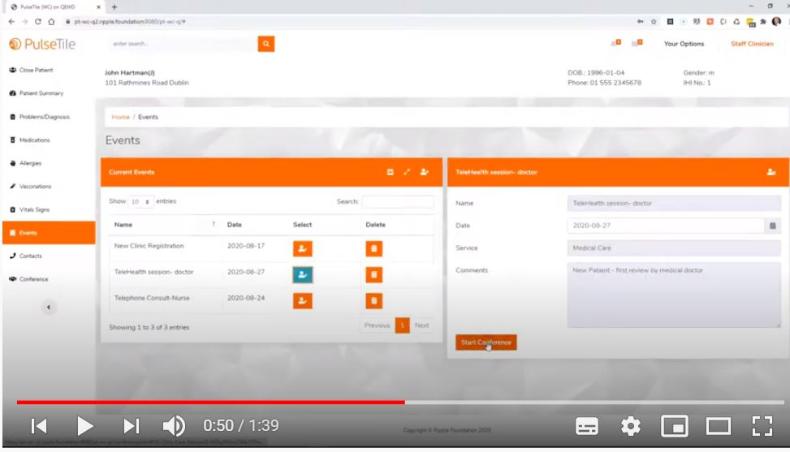

# PulseTile-WebComponents
PulseTile UI framework - version based on Web Component standard tech

  

See Youtube demonstrator of this code in action here  
https://www.youtube.com/watch?v=_X_VjLaZez4&list=PLNxHSK29ViKLrrhdPTqbYr6XGTya4uGBv&index=20

see the pt-wc-q folder within this repo to see the working version of this codebase  
https://github.com/RippleOSI/OS-TeleHealth/tree/PTcollab/www/pt-wc-q

The technology is based on this framework for W3C Web Component development  by @robtweed  
https://github.com/robtweed/mg-webComponents  
including this set of Web Components that make up the Admin UI pattern  
https://github.com/robtweed/wc-admin-ui  
which is in turn based on this open source library  
https://github.com/StartBootstrap/startbootstrap-sb-admin-2
